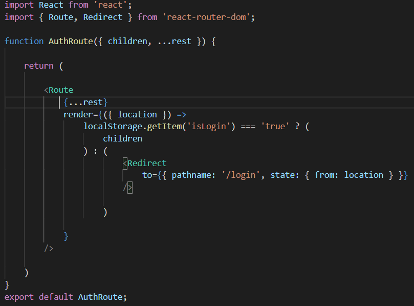

이 포스트는 localStorage를 이용한 로그인을 사용하였고, 로그인 상태면 localStorage에 `isLogin key`값에 `true`를 저장하고, 로그아웃 상태면 `false`를 저장하도록 했습니다. 자 이제 AUTHROUTE라는 js파일을 만들어 봅시다. 저는 로그인 상태일 경우, MyPage로 들어갈 수 있고, 로그아웃 상태일경우 로그인화면으로 `ReDirect` 시켜 주도록 만들었습니다.

[localStorage를 모르신다면?](https://developer.mozilla.org/ko/docs/Web/API/Window/localStorage)

- AuthRoute.js



AuthRoute를 만들어주고, 라우팅을 해주도록 하겠습니다.
App.js에서

- App.js

```tsx
<AuthRoute path="/purchase">
  <PurchaseList />
</AuthRoute>
```

AuthRoute를 선언해준 뒤에

- Home.js

```tsx
<li>
  <Link to="/purchase">구매목록</Link>
</li>
```

링크 path를 설정해줍니다. 그후 PurchaseList라는 컴포넌트를 만들어 주어야 합니다. 이 컴포넌트는 로그인 상태일시에 들어갈수있는 페이지라고 생각하시면 됩니다. 아무 컴포넌트나 만들어서 넣어주시면 됩니다. 그럼 이제 경로가 `/purchase`이면, `PurchaseList`라고 설정해둔 컴포넌트로 라우팅합니다.

끝났습니다. 이제 AuthRoute를 살펴보겠습니다.

AuthRoute의 prop을 통해 `chiledren`과 `...rest`를 받습니다. 여기서 `chiledern`을 통해서 `App.js`에 설정해놓은 `PurchaseList` 컴포넌트를 받아와서 삼항연산자를 사용해 그대로  
`localStorage`에 있는 `isLogin`의 값이 `ture`면 받아온 컴포넌트 `PurchaseList`를 렌더링 해줍니다. 만약 `isLogin`의 값이 `false`면 `Redirect`로 다시 `/login` 페이지로 이동됩니다. 여기서 `state` 옵션에 `location`을 넘겨주었는데, 이것은 로그인 성공시 다시 현재 페이지로 돌아오기 위함입니다.

이 포스팅은 [공식문서](https://reacttraining.com/react-router/web/example/auth-workflow)를 참고하면서 적용하였습니다.
