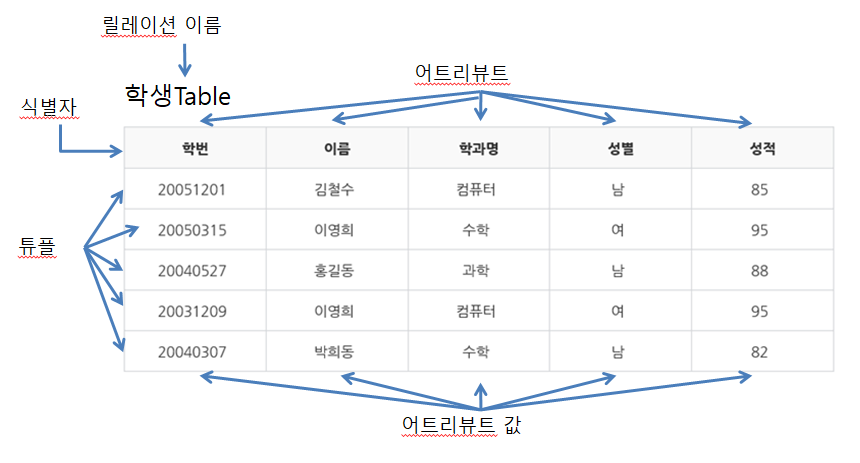

## 목적

이번 포스팅에서는 개발자라면 꼭 필수적으로 알아야 하는 데이터베이스(Database)란 무엇이고, 어떤 문제를 해결해주는지, 왜 사용하는지에 대해서 정리해보았습니다.

# 데이터베이스 (DataBase)란?

데이터베이스는 통합하여 관리되는 데이터의 집합체를 의미합니다. 이는 중복된 데이터를 없애고, 자료를 구조화하며, 효율적인 처리를 할 수 있도록 관리됩니다. 이는 자료 검색과, 갱신의 효율을 높임니다. 이러한 데이터베이스는 응용 프로그램과는 다른 별도의 미들웨어에 의해 관리됩니다. 데이터베이스를 관리하는 이러한 미들웨어를 데이터베이스 관리 시스템(DBMS Management System)이라고 합니다.

## 왜 사용하는가?

데이터베이스란 다수의 사용자가 사용하는 데이터들의 공유와 운영을 위해 저장해 놓는 공간을 말한다. 프로그램을 만들다 보면 프로그램 사용자들에 의해 생성된 데이터, 프로그래머가 필요에 의해 프로그램에 넣어놓은 데이터 등 필연적으로 많은 데이터들이 생성되게 되는데, 데이터베이스를 사용하지 않으면, 이 데이터들은 프로그램이 종료하는 순간 전부 날아가게 됩니다. 이러한 현상을 방지하기 위해서 데이터들을 데이터베이스에 넣고 보관하는 방법을 사용하게 되었습니다.

## 데이터베이스의 특징

데이터베이스는 다음과 같은 특징을 가집니다.

1. 사용자의 질의에 대하여 즉각적인 처리와 응답이 이루어집니다.
2. 생성, 수정, 삭제를 통하여 항상 최신의 데이터를 유지합니다.
3. 사용자들이 원하는 데이터를 동시에 공유할 수 있습니다.
4. 사용자가 원하는 데이터를 주소가 아닌 내용에 따라 참조할 수 있습니다.
5. 응용프로그램과 데이터베이스는 독립되어 있으므로, 데이터의 논리적 구조와 응용프로그램은 별개로 동작됩니다.

## 데이터베이스 용어

- 식별자(Identifier) - 여러 개의 집합체를 담고 있는 관계형 데이터베이스에서 각각의 구분할 수 있는 논리적인 개념.

- 식별자의 특징

  - 유일성 - 하나의 릴레이션에서 모든 행은 서로 다른 키 값을 가져야 합니다.
  - 최소성 - 꼭 필요한 최소한의 속성들로만 키를 구성해야 합니다.

- 튜플(Tuple) - 테이블에서 행을 의미합니다. 같은 말로 레코드(Record) 혹은 로우(Row)라고 하기도 합니다. 튜플은 릴레이션에서 같은 값을 가질 수 없습니다. 튜플의 수는 카디날리티(Cardinality)라고 합니다.

- 어트리뷰트(Attribute) - 테이블에서 열을 의미합니다. 같은 말로 칼럼(Columm)이라고 하며, 어트리뷰트의 수를 의미하는 단어는 디그리(Degree)라고 합니다.

### 쿼리 문법의 세 종류

1. 데이터 정의 언어(DDL)

   - 관계형 데이터베이스의 구조를 정의함
   - 쌍, 속성, 관계 인덱스 파일 위치 등 데이터베이스 고유의 특성을 포함함.
   - CREATE, ALTER, DROP

2. 데이터 조작 언어(DML)

   - 데이터베이스 검색, 등록, 삭제, 갱신을 하기 위해 사용하는 데이터베이스 언어
   - 데이터베이스의 검색 및 업데이트 등 데이터 조작을 위해 사용되는 언어.
   - INSERT, UPDATE, DELETE, SELECT 등

3. 데이터 제어 언어(DCL)
   - 데이터베이스에서 데이터에 대한 엑세스를 제어하기 위한 데이터베이스 언어 또는 데이터베이스 언어 요소
   - 박탈, 연결, 권한 부여, 질의, 자료 삽입, 갱신, 삭제 등
   - GRANT, REVOKE 등

### 참고한 자료

- [코딩팩토리](https://coding-factory.tistory.com/77)
- [TCPSCHOOL](http://tcpschool.com/mysql/DB)
