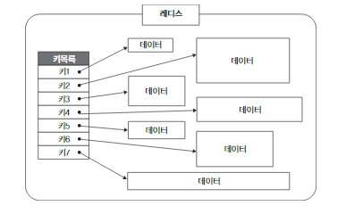
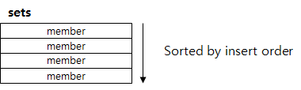
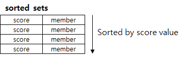
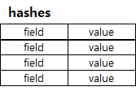
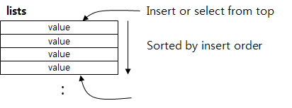

## 목적

로그인 기능을 구현하는 것이 목적이라면 반드시 알아야 할 Redis에 대해서 알아보는 것이 이 글의 목적입니다.

## Redis란?

레디스(Redis)는 "REmote DIctionary System"의 약자로 메모리 기반의 Key/Value Store이며, 리스트, 해시, 셋 정렬된 셋 등 여러 형식의 자료구조를 지원합니다. NoSQL DBMS로 분류되기도 하고, memcached와 같은 In memory 솔루션으로 분리 되기도 합니다. 메모리에 상주하면서 RDBMS의 캐시 솔루션으로서 주로 사용되며 인스타그램, 라인, StackOverflow, 블리자드 등 여러 소셜 서비스에서 사용하는 검증된 오픈소스 솔루션입니다.

## Redis 특징

### Key-Value Store

레디스는 기본적으로 Key/Value Store입니다. 특정 키값에 저장하는 구조로 되어 있고 기본적인 PUT/GET Operation을 지원한다.

이 모든 데이터는 메모리에 저장되고, 이로 인하여 매우ㅎ 빠른 읽기 쓰기 속도가 보장됩니다. 그래서 전체 저장 가능한 데이터 용량은 물리적인 메모리 크기를 넘어설 수 있습니다. 장점은 익히기 쉽고 직관적입니다. 단점은 Key/Value 형태로 저장된 데이터를 레디스 자체 내에서 처리하는 것이 어렵다는 점입니다.

### 다양한 데이터 타입

단순한 메모리 기반의 Key/Value라면 이미 memcached가 있습니다. 그렇지만 어떤 차이 때문에 redis가 유행하는 것일까요?
redis가 Key/Value Store 이기는 하지만 저장되는 Vlaue가 단순한 Object가 아니라 자료구조를 갖기 때문입니다. redis가 지원하는 데이터 형은 크게 아래와 같이 5가지로 나눌 수 있습니다.

1. String

- 일반적인 문자열로 최대 512mbyte 길이까지 지원한다. Text 문자열뿐만 아니라 Integer와 같은 숫자나 JPEG 같은 Binary File까지 저장할 수 있다.

2. Set

- set은 String의 집합이다. 여러 개의 값을 하나의 Value 내에 넣을 수 있다고 생각하면 되며 블로그 포스트의 태그(Tag) 등에 사용될 수 있다. 재미있는 점은 set 간의 연산을 지원하는데, 집합인 만큼 교집합, 합집합, 차이(Differences)를 매우 빠른 시간 내에 추출할 수 있다.

3. Sorted Set

- set에 "score"라는 필드가 추가된 데이터 형으로 score는 일종의 "가중치" 정도로 생각하면 된다. sorted set에서 데이터는 오름차순으로 내부 정렬되며, 정렬이 되어있는 만큼 score 값 범위에 따른 쿼리, top Rank에 따른 query 등이 가능하다.

4. Hashes

- hash는 value 내에 field/string value 쌍으로 이루어진 테이블을 저장하는 데이타 구조체이다. RDBMS에서 PK 1개와 string 필드 하나로 이루어진 테이블이라고 이해하면 된다.

5. List

- list는 string들의 집합으로 저장되는 데이터 형태는 set과 유사하지만, 일종의 양방향 Linked list라고 생각하면 된다. List 앞과 뒤에서 PUSH/POP 연산을 이용해서 데이터를 넣거나 뺄 수 있고, 지정된 Index값을 이용하여 지정된 위치에 데이터를 널거나 뺄 수 있다.

### Persistence

Redis는 데이터 disk에 저장할 수 있습니다. 따라서 Redis는 서버가 shutdown된 후에 restart하더라도 disk에 저장해 놓은 데이터를 다시 읽어서 데이터가 유실되지 않습니다. redis의 데이터를 disk에 저장하는 방식은 snapShot,AOF 방식이 있습니다.

- snapShot : 스냅샷은 RDB에서도 사용하고 있는 어떤 특정 시점의 데이터를 DISK에 옮겨 담는 방식을 뜻합니다. Blocking 방식의 SAVE와 Non-blocking 방식의 BgGSAVE 방식이 있습니다.

- AOF : Redis의 모든 write/update 연산 자체를 모두 log 파일에 기록하는 형태입니다. 서버가 재시작 할 시 write/update를 순차적으로 재실행, 데이터를 복구합니다.

레디스 공식 문서에서의 권장사항은 RDBMS의 rollback 시스템같이 두 방식을 혼용해서 사용하는 것입니다. 주기적으로 snapShot으로 백업하고 다음 snapShot까지의 저장을 AOF 방식으로 수행하는 것이죠.

### ANSI C로 작성

C언어로 작성되어 Java와 같이 가상머신 위에서 동작하는 언어에서 발생하는 성능 문제에 대해 자유롭습니다. 곧바로 기계어로 동작하지 않고 어떤 가상의 머신 위에서 인터프리터 된 언어로 가동하는 경우에는 가비지 컬렉션(Garbage Collection) 동작에 따른 성능 문제가 발생할 수밖에 없습니다. 하지만 C언어로 작성된 Redis는 이런 이슈에서 자유롭다.

### Redis 아키텍처

#### Redis Topology

레디스는 아래 그림과 같이 Master-slave 형태로 데이터를 복제해서 운영할 수 있습니다. 이 master-slave간의 복제는 non-blocking 상태로 이루어집니다.

#### Redis Sharding

레디스에서 데이터를 샤딩하여 레디스의 read 성능을 높일 수 있습니다. 예를 들어 #1~#999, #1000~#1999 ID 형태로 데이터를 나누어서 데이터의 용량을 확장하고 각 서버에 있는 Redis의 부하를 나누어 줄일 수 있습니다.

#### Redis Cluster

레디스는 이전에는 Clustering을 지원하지 않았지만 Clustering을 지원하면서 대부분의 회사가 Redis를 클러스터로 묶어서 가용성 및 안정성 있는 캐시 매니저로써 사용하고 있습니다. Single Instance로서 레디스를 사용할 때는 Sharding이나 Topolgy로서 커버해야 했던 부분을 Clustering을 이용함으로써 어플리케이션을 설계하는 것이 더 수월해졌다고 볼 수 있습니다.

## 사용 시 주의할 점

#### 장애가 났을 경우 그에 대비한 운영 플랜이 세워줘야 함

Redis는 인 메모리 데이터 저장소라서 서버가 장애가 났을 경우 데이터 유실이 발생합니다. 따라서 위에서 이야기한 snapShot, AOF 기능을 통한 복구 시나리오가 제대로 세워져 있어야 데이터 유실에 대비한 사고에 대처할 수 있습니다.

#### 캐시 솔루션으로 사용할 시 잘못된 데이터가 캐시되는 것을 방지, 예방해야 함

레디스와 캐싱하고자 하는 데이터 저장소의 데이터가 서로 일치하는지 주기적인 모니터링과 이를 방지하기 위한 사내 솔루션을 개발하는 것이 좋습니다.
