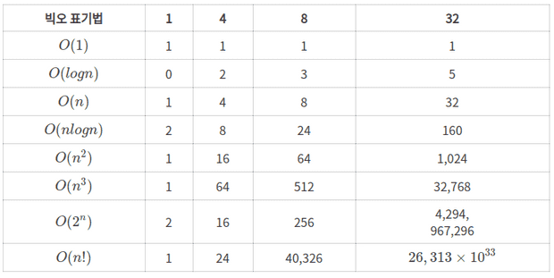

### 목적

알고리즘의 성능을 판단하는 시간 복잡도, 공간 복잡도에 대해서 알아보도록 합시다.

# 시간 복잡도와 공간 복잡도(Time Complexity Space Complexity)

## 시간 복잡도, 시간 복잡도 함수

시간 복잡도는 알고리즘의 절대적인 실행 시간을 나타내는 것이 아닌 알고리즘을 수행하는 데 연산들이 몇 번 이루어지는지를 숫자로 표기합니다.

그런데 연산의 실행 횟수는 보편적으로 그 값이 변하지 않는 상수가 아니라 입력한 데이터의 개수를 나타내는 n에 따라 변하게 됩니다.

연산의 개수를 입력한 데이터의 개수 n의 함수로 나타낸 것을 시간 복잡도 함수라고 말합니다.

## Big-O

빅오 표기법은 알고리즘의 효율성을 표기해주는 표기법이다.
보통 시간 복잡도와 공간 복잡도를 나타내는데 주로 사용된다.
Big-O는 최고차항만을 계산합니다.



### 시간 복잡도 예시

앞서 이야기한 대로 시간 복잡도란 알고리즘이 수행되는데 소요되는 연산 횟수를 이야기합니다.

```tsx
function sample(arr, n) {
  for (let i = 0; i < arr.length; i++) {
    if (arr[i] === n) return i
  }
}
```

위에서 arr의 값이 10이고, n의 값이 1일 경우 연산 횟수는 1이 된다. 하지만 n의 값이 10이라면 연산 횟수는 10이 된다. 그러므로 빅오 표기법으로 표현하면 위 코드의 시간 복잡도는 O(n)이 됩니다. 알고리즘을 평가할 때 최선의 경우(Best Case), 평균적인 경우(Average Case), 최악의 경우(Worst Case)로 나눈다고 합니다.

그러면 평균적인 경우의 값이 가장 의미가 있어 보이지만, 알고리즘이 복잡해질수록 평균값을 계산하기가 어려워지기 때문에 일반적으로 시간 복잡도는 최악의 경우를 많이 사용한다고 합니다.

## 공간 복잡도

공간에 대한 개념으로 알고리즘이 공간을 얼마나 필요로 하는지를 나타낸다.

크기가 N인 배열을 만든다고 가정하면 공간 복잡도가 O(N)이 되고 NxN인 배열을 만들면 O(NxN)이 됩니다.
