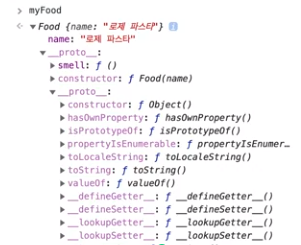
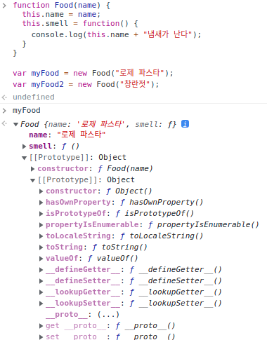

### 원시타입

있는 그대로 저장되는 데이터를 표현한다.

- true, false
- 숫자
- 문자열
- null
- undefined

### 특징

원시값을 변수에 할당하면 값이 복사되어 들어간다. 즉, 원시값이 할당된 변수들은 모두 자기 자신만의 고유한 값을 가지게된다.

### typeof

원시값의 종류를 알 수 있게 해주는 메서드
하지만 null을 출력할경우 object가 나오는데, 자바스크립트에서 object는 객체 참조타입을 의미하는데 이건 원시타입이 아니다. [자바스크립트 오류]

### 참조타입

자바스크립트 객체를 나타낸다.

- 객체 {}
- 배열 []
- 함수 function
- Date
- 정규표현식 RegExp
- 원시타입 빼고 전부 참조타입

### 특징

참조 타입은 변수에 값을 직접 저장하지 않는다. 변수에 저장되는 것은 메모리 안에서 객체의 위치를 가리키는 "포인터" 이다. 즉 무엇이 저장되느냐, 이것이 원시 타입과 참조 타입의 가장 큰 차이다.

```tsx
const objOne = { one: 1 }

const objTwo = { two: 2 }

objTwo = objOne

objTwo.one = 3

console.log(objOne)
console.log(objTwo)
```

결과를 출력해보면 둘다 값이 3인 것을 확인 할 수 있다.

### 원시 래퍼 타입

원시 타입을 객체처럼 편리하게 사용하도록 도와준다.

- String
- Number
- Boolean

### 특징

원시 타입을 객체처럼 사용하는 순간, 자바스크립트 내부에서 사용하는 데이터의 인스턴스를 만들게됩니다. 이렇게 만들어진 객체는 코드를 실행후 바로 다음 줄에서 파괴됩니다. 이러한 과정을 오토박싱이라고 한다.

### this

this를 이용하면 함수를 다른 객체에서 사용 할 수 있다.

```tsx
function menuGlobal() {
  console.log('오늘 저녁은' + this.name)
}

var myDiner = {
  name: '김치찌개',
  menu: menuGlobal,
}

var yourDiner = {
  name: '된장찌개',
  menu: menuGlobal,
}
myDiner.menu()
yourDiner.menu()
```

### this제어

- call()
  - call 메서드는 this의 값을 바꿀 수 있고, 함수를 실행할 때 사용할 인수도 전달할 수 있다.

````tsx
function menuGlobal(item) {
  console.log("오늘 저녁은" + item + this.name)
}

var myDiner = {
  name : "김치찌개"
}

var yourDiner = {
  name: "된장찌개"
}

menuGlobal.call(myDiner, "묵은지");
menuGlobal.call(yourDiner, "삼겹살");
```tsx

- apply()
  - apply 메서드는 함수를 실행할 때 인수를 배열로 묶어 한번에 전달한다.

````

function menuGlobal(item1, item2) {
[item1, item2].forEach(function(el){

console.log("오늘 저녁은 " + el + this.name)
},this)
}

var myDiner = {
name : "김치찌개"
}

var yourDiner = {
name: "된장찌개"
}

menuGlobal.apply(myDiner, ["묵은지", "삼겹살"])

```

### bind()

bind 메서드는 es5에서 추가되었다. this값을 어디서 사용하든 호출 객체가 바뀌지 않게 고정시켜버린다.

### 화살표 함수와 this

화살표 함수의 this는 일반적인 this처럼 함수를 호출한 객체를 할당하지 않고, 바로 상위 스코프의 this를 할당한다.

### 스코프

스코프는 이름이 출동하는 문제를 덜어주고, 자동으로 메모리를 관리한다.

### 전역 스코프

스크립트의 어디서든 접근이 가능하기 때문에 사용이 쉽다. 타인과의 협업, 라이브러리 사용시 충돌의 가능성이 있다.

### 함수 스코프

함수 내부에서 정의된 변수와 매개변수는 함수외부에서 접근할 수 없다. 함수 내부에서 정의된 변수라면 함수의 어느 부분에서도 접근 할 수 있다.

### 블록 스코프

중괄호 안에서만 접근이 가능하다. 블록 내부에 정의된 변수는 블록의 실행이 끝나면 해제된다.

### 스코프 정리

- 스코프는 변수의 접근성과 생존기간을 제어한다.
- 스코프는 이름이 충돌하는 문제를 덜어주고, 자동으로 메모리를 관리한다.
- 자바스크립트에는 전역 스코프, 함수 스코프, 블록스코프가 존재한다.

### 클로저

말로 표현하면 폐쇄된 공간에 대한 접근 권한을 가진함수를 말한다.

만약 내부 함수가 외부 함수보다 오래 살아있는 경우에, 외부함수에 있던 변수들은 어떻게 될까?

```

var outer = function() { // 외부함수
var a = 1; // outer함수가 반환된 후에도 inner함수는 outer 함수 안에 있는 a에 대한 접근 권한을 가진다. 그래서 변수 a는 메모리에서 해제되지 않은 상태이다.

var inner = function() { // 내부함수
var b = 5;
var c = 6;

    a = a + b + c;
    console.log(a);

};
return inner;
};

var newInner = outer();

newInner();

```

이러한 특징을 이용하면 비공개 데이터를 가진 객체를 만들어 볼 수 있지 않을까?

```

var person = (function() {
var age = 15;

return {
name : "Wade",

    getAge : function() {
      console.log(age);
      return age;
    },

    setAge : function(val) {
      age = val;
      console.log(age);
    }

};
})();
person.setAge(20); // person //이런 방식으로 외부함수에 있는 데이터를 변경할 수 있다.
person.getAge();

```

### 프로토타입

```

function Food(name) {
this.name = name;
this.smell = function() {
console.log(this.name + "냄새가 난다");
}
}

var myFood = new Food("로제 파스타");
var myFood2 = new Food("창란젓");

console.log(myFood.smell === myFood2.smell); // false

```

myFood.smell 메소드와 myFood2.smell 메소드는 서로 다른 참조를 하고 있었다.

즉 객체를 생성 할때마다 별개의 함수가 계속 만들어 진것. 앞서 this에서 배운 내용을 바탕으로 좀 더 효율적인 공정으로 바꿔보자

```

function smell() {
console.log(this.name + "냄새가 난다");
}

function Food(name) {
this.name = name;
this.smell = smell;

}

var myFood = new Food("로제 파스타");
var myFood2 = new Food("창란젓");

myFood.smell();
myFood2.smell();
console.log(myFood.smell === myFood2.smell); // true

```

smell 함수를 밖으로 빼 문제를 해결했다.

```

myFood.constructor === Food // true // constructor는 어디서 온걸까?

```

자바스크립트에서는 생성자의 prototype 프로퍼티를 통해 타입의 특징을 정의한다.

모든 인스턴스는 내부에 [[Prototype]] 프로퍼티를 가지며, 이를 통해 생성자의 prototype 프로퍼티를 추적한다.



```

Food.prototype.smell = function() {
console.log(this.name + "냄새가 난다");
}

function Food(name) {
this.name = name;

}

var myFood = new Food("로제 파스타");
var myFood2 = new Food("창란젓");

myFood.smell();
myFood2.smell();
console.log(myFood.smell === myFood2.smell);

```

이렇게 했더니 결과값이 같다.

myFood [[prototype]] -> Food [[Prototype]] -> Object [[Prototype]] -> null

이런식으로 인스턴스에서 생성자의 [[Prototype]]을 타고 올라가며 프로퍼티를 탐색하는 현상을 프로토타입 체인이라고 한다.

### 정리

- 자바스크립트는 생성자의 prototype 프로퍼티를 통해 타입의 특징을 정의한다.
- 모든 인스턴스는 내부에 [[Prototype]]프로퍼티를 가지며 이를 통해 생성자의 prototype 프로퍼티를 추적한다.
- 인스턴스에서 생성자의 [[Prototype]]을 타고 올라가며 프로퍼티를 탐색하는 현상을 프로토타입 체인이라고 한다.

브라우저 콘솔에 직접 쳐보면
>

```

이렇게 확인이 가능g하다.

```

### 클래스

클래스는 정확히 생성자를 이용한 타입 생성과 그 결과가 일치한다.

자바스크립트만의 사용자 정의타입 생성 방법을 다른 언어의 클래스 문법처럼 바꿔준것이 바로 자바스크립트 클래스다.

```

class User {
constructor(name) {
this.name = name;
}
sayName() {
console.log(this.name);
}
}

var me = new User("Wade");
me.sayName(); // wade

function UserOld(name) {
this.name = name;
}

UserOld.prototype.sayName = function() {
console.log(this.name)
}

var user = new UserOld("Wade");
user.sayName(); //wade

```

위 아래 코드처럼 내부동작은 동일하지만, 더 보기 좋고 편리하게 개선된 문법을 슈가 신텍스라고 부른다.

```

class Sausage {
constructor(el1, el2) {
this.inside1 = el1;
this.inside2 = el2;
}

taste() {
return this.inside1+ "와" + this.inside2 + "맛이 난다!";
}
}

var classicSausage = new Sausage("닭고기", "양파");
// console.log(classicSausage.taste());

class FireSausage extends Sausage{
constructor(el1, el2, el3) {
super(el1, el2);
this.inside3 = el3;
}
flavor(){
return this.inside3 + "의 풍미도 있다!";
}
}

var classicFireSausage = new FireSausage("소고기", "파","불맛");
console.log(classicFireSausage.flavor());

```

이런식으로도 자바랑 비슷하게 사용할수 있다.

### 정리

- 자바스크립트의 타입 생성 방법을 다른 언어와 비슷하도록 보기 쉽게 개선한 것이 바로 자바스크립트 클래스다.
- extends 연산자를 통해 상위 타입의 프로퍼티를 상속받습니다.
- super 메소드를 통해 자식 클래스의 생성자 함수가 부모 클래스의 생성자 함수를 덮어 씌우는 것을 방지 할 수 있다.
```
