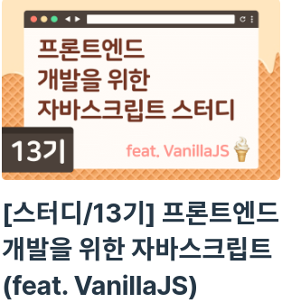

# 2021년 상반기 회고

나는 프론트엔드 개발자를 목표로 다시 개발공부를 시작했다. 이 글을 쓰면서 내가 매일 꾸준히 해야할 것을 정리하고자 한다.

### 우선순위

나는 여태 React만 집중적으로 공부했다. 여태까지 한 프로젝트도 React였고, 가장 중요하다고 생각했다. 하지만 실제는 내가 생각 한 것과 많이 달랐다.

1. JavaScript
2. 네트워크, 브라우저 동작 원리 CS
3. React
4. HTML + CSS

그리고 나는 이런식으로 우선순위를 나열했다. 그리고 앞으로 공부할 계획을 작성했다.

### 첫번째 코딩테스트

코딩테스트를 통과하지 못하면 위에 나열한 것들이 의미가 없다.

하루를 시작하기전 노트북을 키고 매일매일 프로그래머스 or 백준 문제를 꾸준히 한문제씩 푼다. 만약 문제 난이도가 낮아서 시간이 남을경우 한문제를 추가해서 푸는 경우도 있다. 내가 풀지 못한 문제는 외워서 이해한다.

### 두번째 자바스크립트

1. 운이 좋게 타이밍이 맞아서 프로그래머스에서 4주동안 진행하는 프론트엔드 개발을 위한 자바스크립트 코드리뷰 스터디를 참여 할 수 있게되었다.
   
   1월 12일부터 시작이니 정말 열심히 해봐야겠다.

2. 책을 꾸준히 하루에 30페이지씩 읽고있다. 이번에 읽고있는 책은 모던 자바스크립트 핵심가이드 라는 책이고, 매일 React를 주로 공부해 순수 javaScript에 대해 부족한 나에겐 정말 좋은 책이라고 생각한다. 이해를 돕기위해 가볍게 확인할 수 있는 예제도 많고 두께가 두껍지도 않은 편이다. 또한 밥먹을때 인강이나 개발관련 유튜브를 보면서 공부를 하고있다.

### 프로젝트

현재도 프로젝트를 준비하고 있다. 협업을 경험하고싶은 사람들끼리 팀을 짜서 꾸준히 제작하고있기는 한데, 다 익숙하지 않다보니 진행하는게 매끄럽지 않은 것 같다.

자바스크립트를 이용한 프로젝트 하나, 리액트를 이용한 프로젝트 하나를 꾸준히 커밋해서 포트폴리오를 만들어볼 예정이다. 프로젝트를 하면서 어떤 API, 라이브러리, 프레임워크를 사용하면 그 사용한 이유를 README에 정리하고, 하나를 사용하더라도 제대로 알고 사용한다는 정신으로 만들어보려고 한다.

### CS공부

나름 컴퓨터 공학과지만 컴퓨터 공학에 대한 지식이 많이 부족한 편이다. 토요일 일요일에 코딩테스트 준비를 하면서, 중요한 것들을 꾸준히 정리해서 프린트로 뽑을 예정이다.
