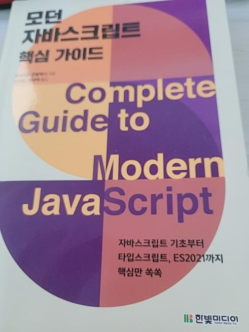

  

## 주요 내용

- 변수, 자료형, 함수 등 자바스크립트 문법
- 화살표 함수, 템플릿 리터럴, 프로미스 등 ES6 기능 등등

## 이 책을 읽게 된 이유

자바스크립트 문법을 꾸준히 공부하기 위해서, 또 내용이 알차다 기억이 안 나는 부분이 있으면 찾아보려고 구매했다.

## 책을 읽으면서 좋았던 부분

면접에서 나올법한 기본 상식들 var, let, const 차이점, this, 프로토타입 등을 간단한 예제로 이해하는데 어려움이 없었다. 또한 자주 사용하는 템플릿 리터럴, 문자열 메서드, 디스 트럭 쳐 링, 배열 메서드 등 꼭 공부해야 하는 것들을 알기 쉽게 설명해 준다. 아직 못 읽은 부분이 있지만 두고두고 계속 읽어야겠다.
