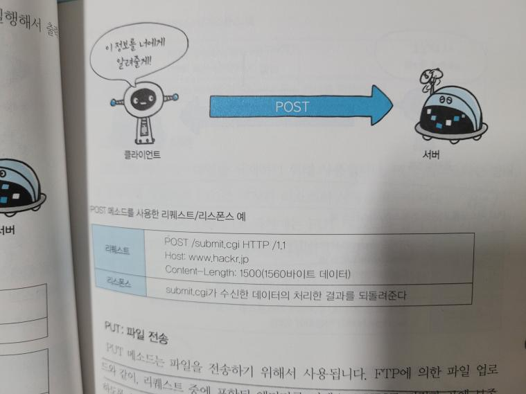

 
 

### 이 책을 읽게 된 이유

스터디를 목표로 구매한 책인데, 스터디가 끝나고 현재도 계속 기억이 안 날 때마다 계속 보고 있다. `밥 먹으면서 읽기 좋은 책 베스트`

 

### 주요 내용

HTTP를 비롯한 네트워크 관련 내용을 쉽게 설명해놓은 책이다. 기본적으로 웹과 네트워크, HTTP 헤더 ,메세지, 상태코드, HTTPS, 보안등 알기쉽게 설명해준다. 책을 읽으면서 나혼자 스스로 흐름을 생각하면서 읽을 수 있을정도로 좋은 책이다.

책을 읽으면서 가장 기억에 남았던 부분을 정리하자면, Http로 하는 통신은 기본적으로 보안에 취약하다. 통신을 할 때 암호화를 하지 않기 때문이다. 그래서 서버와 클라이언트가 통신을 하는 도중 누군가가 리스폰스나 리퀘스트를 도청하거나 위장, 가로챌 수 있다. 예를 들어 악성 스크립트를 사용해서 공격하는 XSS 등에 당하기 쉽다. 그래서 나온 것이 HTTPS다. HTTPS는 HTTP에서 프로토콜 종류인 SSL를 사용해서 통신을 하는 것으로 통신 통로를 암호화된 통로로 덧씌운다고 생각하면 편하다. 보안이 좋은 대신 단점이 존재한다. 아무대로 암호화를 하는 과정이 있기 때문에 서버에 과부하를 줄 수 있고, 속도가 느리다는 점이다. 또한 HTTPS는 공개키 알고리즘 방식으로 암호화하는 방식이다.

http에는 인증 방식이 존재한다. 첫 번째 Basic, Digest, SSL 클라이언트, form 베이스 인증 방식이 있다. Basic은 보안이 취약해서 잘 사용하지 않고, Digest 인증 방식은 Basic 인증 방식에 비해 보안은 좋은 편이나 그다지 많이 사용하지 않는다고 한다. SSL 클라이언트 방식은 인증 기관에서 인증서를 구입해 클라이언트에 유지하면서 인증하는 방식인데, 인증 비용이 만만치 않아 자주 사용되는 방식이 아니라고 한다. 마지막으로 form 베이스 인증 방식은 세션과 쿠키를 이용해 로그인을 성공하면 서버에서 클라이언트한테 Http 헤더에 set-cookie라는 이름의 session-id를 담아서 보낸다. 그러면 클라이언트는 쿠키를 저장하고 인증이 필요할 때마다 서버에 쿠키를 담아서 보낸다. 그 후 서버는 인증이 올 때마다 http 헤더에 담긴 쿠키를 확인하고 응답한다. http는 스테이트 리스 프로토콜이기 때문에 인증했다는 상태를 저장할 수 없다. 그래서 쿠키 세션을 사용한다.

 

### 마치며

좋았던 부분은 책의 내용이 그렇게 많지도 않고 적당하다 또한 알차고 재미있게 읽을 수 있다. 단점은 오래된 책이라 http 2.0에 대한 설명이 부족하다.
